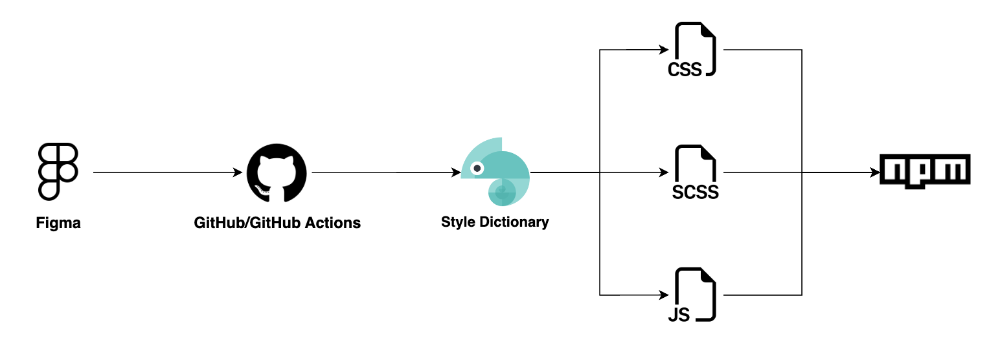

# Design Tokens

[デジタル庁 デザインシステム（Figma）](https://www.figma.com/@jpdigitalagency)のデザイントークンを CSS, SCSS, JavaScript のいずれかで扱える仕組みを実装したリポジトリです。
変換されたデザイントークンは npm パッケージとして公開しています。

[](https://badge.fury.io/js/@digital-go-jp%2Fdesign-tokens)

## パッケージのインストール

```
$ npm install @digital-go-jp/design-tokens
```

## 使用例

### CSS

```css
@import url("node_modules/@digital-go-jp/design-tokens/dist/tokens.css");

.button {
  padding: 16px;
  font-size: var(--text-button-font-size)
  font-weight: var(--text-button-font-weight);
  line-height: var(--text-button-line-height);
  letter-spacing: var(--text-button-letter-spacing)
  background-color: var(--color-light-button-normal);
  border-radius: var(--border-radius-sm);
  color: var(--light-text-on-fill);
}

.button:hover {
  background-color: var(--light-button-hover);
}
```

### SCSS

```scss
@import 'node_modules/@digital-go-jp/design-tokens/dist/tokens.scss';

.button {
  padding: 16px;
  font-size: $text-button-font-size;
  font-weight: $text-button-font-weight;
  line-height: $text-button-line-height;
  letter-spacing: $text-button-letter-spacing;
  background-color: $color-light-button-normal;
  border-radius: $border-radius-sm;
  color: $light-text-on-fill;
}

.button:hover {
  background-color: $light-button-hover;
}
```

### JavaScript

以下のnpmパッケージのようにトークンを利用しています。

https://www.npmjs.com/package/@digital-go-jp/tailwind-theme-plugin

## Figma（デザインシステム）とのバージョン対応表

| Figmaのバージョン | npmのバージョン |
| ----------------- | --------------- |
| 1.4.0             | 0.0.15          |
| 1.3.4             | 0.0.13          |
| 1.3.3             | 0.0.9           |

## デザイントークンの変換の仕組み

1. [Tokens Studio for Figma](https://github.com/tokens-studio/figma-plugin)でデザイントークンを json として出力
2. 出力された json を StyleDictionary で扱いやすい json に変換
3. StyleDictionary を実行し、css, scss, js ファイルを出力



## 主な利用プラグインやライブラリ

- [Tokens Studio for Figma](https://github.com/tokens-studio/figma-plugin)
- [Token Transformer](https://github.com/tokens-studio/figma-plugin/tree/main/token-transformer)
- [StyleDictionary](https://github.com/amzn/style-dictionary)
